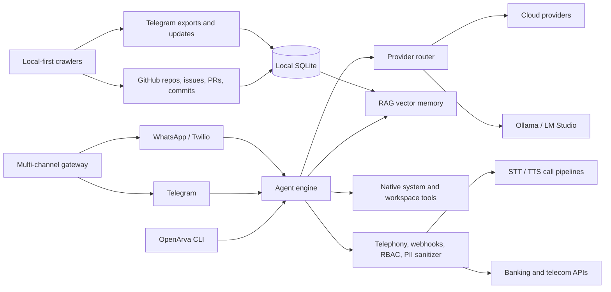

# openarva: The Autonomous Multi-Channel AI Agent Ecosystem

[](package.json)
[](LICENSE)
[](src/memory/vectorStore.ts)
[](SECURITY.md)
[](https://github.com/fekerulegese10-arch/openarva/actions/workflows/security.yml)

openarva is a local-first personal AI agent for coding, automation, research, education, design, telecommunications, banking, call centers, and enterprise workflows. It combines multiple AI providers, a Telegram/WhatsApp gateway, GitHub and Telegram crawlers, secure native tools, persistent tasks, and local retrieval memory.

## Install

```bash
npm i -g openarva
npx openarva init
```

From a checkout:

```bash
npm install
npm run build
npm test
```

## Architecture



- **Gateway**: routes inbound messages to the agent and sends responses back through the originating channel.
- **Local-first crawlers**: fetch GitHub and Telegram data into `~/.openarva/crawls/openarva-crawls.sqlite`.
- **Native system tools**: inspect system status/processes, capture Windows screenshots, search/edit workspaces, and run approval-gated sandbox commands.
- **RAG memory**: stores local embeddings in `~/.openarva/memory/vectors.sqlite` and retrieves relevant chats and indexed context.
- **Task daemon**: persists work under `~/.openarva/state.db` and resumes queued tasks after restarts.
- **Enterprise controls**: SIP/telephony pipeline interfaces, signed webhooks, RBAC, audit logging, sensitive-data masking, multilingual support, and human escalation decisions.

## CLI reference

| Command | Purpose |
| --- | --- |
| `openarva init` | Interactive first-time setup. |
| `openarva setup` | Alias for `init`. |
| `openarva demo` | Try OpenArva without an API key. |
| `openarva sponsor` | Show public sponsorship channels and the public crypto donation wallet. |
| `openarva start` | Start the persistent task daemon in the background. |
| `openarva daemon` | Run the task daemon in the foreground. |
| `openarva gateway start` | Start the managed multi-channel gateway. |
| `openarva gateway daemon` | Run the gateway in the foreground. |
| `openarva gateway status` | Inspect the managed gateway. |
| `openarva gateway stop` | Stop the managed gateway. |
| `openarva serve --port 3000` | Run the HTTP/WebSocket gateway. |
| `openarva crawl git owner/repository` | Crawl GitHub repository metadata, issues, PRs, and commits. |
| `openarva crawl telegram --file export.json` | Index a Telegram JSON export. |
| `openarva learn --index ./docs` | Index local files into memory. |
| `openarva learn --forget` | Clear local learning memory. |
| `openarva update --models` | Discover providers, pull local Ollama models, and benchmark. |
| `openarva mode design "..."` | Use the design workflow. |
| `openarva mode edu "..."` | Use the education workflow. |
| `openarva mode dev "..."` | Use the developer/enterprise workflow. |
| `openarva tasks` | Show persistent task memory. |
| `openarva doctor` | Diagnose runtime, Git, paths, config, and providers. |
| `openarva fix "..."` | Run an approved repository repair workflow. |
| `openarva status` | Show runtime and provider status. |
| `openarva batch --dir ./docs` | Process supported documents in bulk. |
| `openarva usage --export json` | View or export local usage telemetry. |
| `openarva service install` | Install Windows Task Scheduler or Linux systemd startup. |
| `openarva dashboard` | Start the gateway and open its dashboard. |

Native tools are invoked through the agent instruction protocol:

```bash
openarva run --domain coding --instruction 'TOOL:{"name":"system.status"}'
openarva run --domain coding --instruction 'TOOL:{"name":"workspace.search","input":{"query":"TODO"}}'
```

Available tools include `system.status`, `system.processes`, `system.screenshot`, `system.exec`, `workspace.search`, `workspace.edit`, and `workspace.exec`. There is no separate top-level `openarva tool exec` command; using `TOOL:{...}` keeps execution inside the agent approval and sandbox path.

## Enterprise support workflows

The enterprise APIs support telecommunications, banking, and call-center deployments:

| Module | Capability |
| --- | --- |
| `src/connectors/sip.ts` | SIP call lifecycle, audio frames, STT, and TTS interfaces. |
| `src/connectors/telephony.ts` | Call sessions, transcripts, and Amharic/Afaan Oromoo/English speech pipelines. |
| `src/connectors/webhook.ts` | HMAC-signed REST webhook parsing, payload sanitization, and permission checks. |
| `src/security/sanitizer.ts` | Credit-card, account, PIN, OTP, national-ID, email, and phone redaction. |
| `src/security/auditLogger.ts` | Enterprise roles, permissions, and append-only audit events. |
| `src/agent/escalate.ts` | Inquiry classification, fraud detection, language detection, and human escalation. |

Fraud alerts are routed as critical escalation decisions. Sensitive or low-confidence requests can be routed to regulated support queues instead of being answered autonomously.

## Plugin and extension API

Third-party developers can create channel connectors and native tools with [src/plugins/index.ts](src/plugins/index.ts). Plugins can register gateway-compatible connectors, tools, and activation hooks. Validate inputs, avoid secret leakage, and use the existing approval/sandbox paths for system operations.

## First-time setup wizard

Run:

```bash
npx openarva init
```

The wizard guides you through:

1. AI provider and default model
2. API key and compatible base URL
3. Optional local LLM endpoint, such as Ollama or LM Studio
4. Optional Telegram bot token
5. Optional repository paths for later indexing
6. Organization and developer identity

Secrets are written to the local OpenArva configuration directory. Do not commit `.env`, tokens, credentials, or session data.

## Telegram connector quickstart

1. Create a bot with Telegram `@BotFather` and copy its token.
2. Configure the token on the gateway host.
3. Start the gateway.

PowerShell:

```powershell
$env:TELEGRAM_BOT_TOKEN = "123456:replace-with-your-token"
openarva gateway daemon --port 3000
```

Linux/macOS/Termux:

```bash
export TELEGRAM_BOT_TOKEN="123456:replace-with-your-token"
openarva gateway daemon --port 3000
```

OpenArva uses Telegram long polling. Text messages are forwarded to the agent and replies are sent with the Telegram Bot API. An invalid token stops Telegram polling instead of producing an endless retry loop.

## WhatsApp connector quickstart

OpenArva supports WhatsApp through the Twilio WhatsApp webhook and REST API bridge.

```bash
export TWILIO_ACCOUNT_SID="AC..."
export TWILIO_AUTH_TOKEN="your-twilio-auth-token"
export TWILIO_WHATSAPP_NUMBER="whatsapp:+14155238886"
openarva gateway daemon --port 3000
```

Configure your Twilio inbound webhook as:

```text
https://your-public-host.example/webhooks/whatsapp
```

The gateway accepts Twilio form-encoded or JSON payloads. Use HTTPS and authentication when exposing the endpoint publicly. Without Twilio credentials, inbound parsing is available but outbound replies are disabled.

Gateway health:

```bash
curl http://127.0.0.1:3000/health
```

## GitHub crawler

```bash
export GITHUB_TOKEN="your-github-token"
openarva crawl git fekerulegese10-arch/openarva
```

The crawler indexes repository metadata, issues, pull requests, and recent commits into local SQLite storage. A token is optional for public repositories but recommended for API rate limits.

## Security and privacy

[](SECURITY.md)
[](src/memory/vectorStore.ts)
[](SECURITY.md)

- Commands use an allowlisted, shell-disabled sandbox with destructive-command checks.
- File edits show a diff preview and require approval.
- Local crawls, tasks, and vector memory are stored under `~/.openarva/`.
- Tokens and session files are excluded by `.gitignore`.
- Review `SECURITY.md` before deploying a gateway or connector.
- Enterprise webhook handlers require HMAC signatures and explicit RBAC permissions.
- Do not send raw payment data, PINs, national IDs, or account credentials to an untrusted model provider.

## Desktop packaging

Electron tray packaging is configured for Windows and Linux:

```bash
npm run desktop:win
npm run desktop:linux
npm run desktop:build
```

## Development

```bash
npm run build
npm test
```

Supported environments include Windows, Linux, macOS, and Android/Termux. The project uses TypeScript with NodeNext ESM output.

## Community

- Repository: https://github.com/fekerulegese10-arch/openarva
- Issues: https://github.com/fekerulegese10-arch/openarva/issues
- Telegram: https://t.me/openrva177
- WhatsApp: https://whatsapp.com/channel/0029Vb8TDKr72WTmtjfWju2s
- Contributing: [CONTRIBUTING.md](CONTRIBUTING.md)
- Security policy: [SECURITY.md](SECURITY.md)

## Sponsorship

- GitHub Sponsors: https://github.com/sponsors/fekerulegese10-arch
- USDT (TRC20): `TNfDCVCZ11PTrQRTXzoAPhQPBuQetf1MSQ`
- Open Collective: https://opencollective.com/openarva
- Buy Me a Coffee: https://buymeacoffee.com/openarva

Use `openarva sponsor` to print the current public destinations. OpenArva never requests private keys, seed phrases, passwords, API tokens, or card numbers.

## License

MIT. See [LICENSE](LICENSE).
